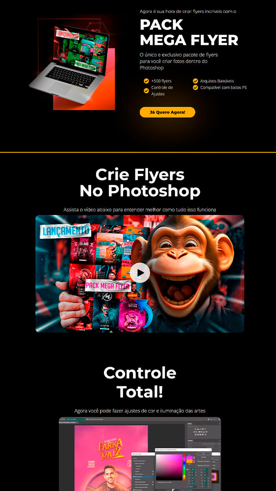

# 🎨 Landing Page – Pacote de Flyers para Photoshop

Landing page profissional para divulgação e venda do **Pack Mega Flyer**, um pacote exclusivo com mais de 500 modelos de flyers prontos para edição no Photoshop.

---

## 📦 O que é este projeto?

Este projeto é uma landing page moderna e responsiva desenvolvida para promover o **Pack Mega Flyer** – um conjunto exclusivo de flyers para criar artes visuais impressionantes diretamente no Photoshop.

---

## 🚀 Funcionalidades

- Estrutura pronta para importar no Elementor
- Estilo visual impactante e moderno
- Seções com destaque para:
  - Produto e benefícios
  - Galeria visual com previews dos flyers
  - Botão de chamada para ação (CTA)
- Compatível com dispositivos móveis (responsivo)
- Sem uso de banco de dados ou backend personalizado

---

## 🛠️ Tecnologias e Ferramentas

---

## ⚙️ Como usar

1. Instale o WordPress em seu servidor local ou hospedagem.
2. Instale e ative o plugin **Elementor**.
3. Vá até *Modelos > Importar modelos*.
4. Importe o arquivo `template-elementor.json` incluído neste repositório.
5. Insira o modelo em uma nova página e publique.

---

## 📸 Pré-visualização

Abaixo uma visão geral do design da página:

- Destaque visual do produto com mockup
- Vídeo com botão de play explicativo
- Seção de recursos e diferenciais
- Galeria com artes promocionais
- Chamada para ação clara e objetiva

---

## 📝 Licença

Este template é distribuído sob a licença MIT.  
Sinta-se livre para usar, modificar e adaptar conforme sua necessidade.
